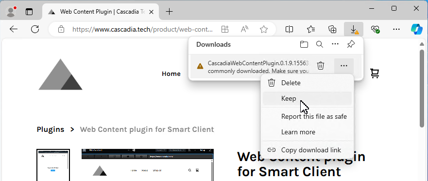
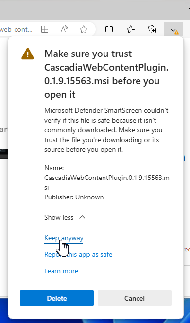

# Web Content Plugin for XProtect Smart Client

Add rich web content to the Smart Client with a browser component that is
always up to date and widely compatible with the modern web, popular IoT
platforms, and more.

The Web Content plugin uses the Microsoft Edge WebView2 runtime which means it
will always be kept up to date without the need to upgrade the plugin. And
because it is a Microsoft Edge browser, it will work with whatever content you
need it for.


## Getting started

### Install the plugin

Download and run the [CascadiaWebContentPlugin](https://download.cascadia.tech/software/CascadiaWebContentPlugin.0.1.13.61951.msi) installer.

The installer is not currently signed and your browser will warn you about the file is potentially unsafe. You can
validate the file hash against the SHA256 hash below.

```plaintext
SHA256: 29F5DB4698BAAA807D166BAC8DD29D59048875FE6668578C448984FEF7A03151
```

Click **Keep**, and if your browser asks again, click **Keep anyway**. The installation experience will improve when I
get a code signing certificate setup.

The installer is very simple and has no options. Acknowledge the license, and then it will install the Microsoft Edge
WebView2 Runtime if necessary, and place the plugin files in `C:\Program Files\VideoOS\MIPPlugins\CascadiaWebContentPlugin\`.





### Add Web Content to a view

1. Open a new Smart Client instance (plugins are only discovered during startup) and login.
2. Click the **Setup** button at the top right.
3. Select an existing view, or create a new view.
4. Locate **Cascadia Technology > Web Content** in the **System Overview** side panel, and drag it into the view.


### Configuration

1. With the new Web View selected, scroll to the bottom of the side panel where you'll find the properties.
2. Update the Home address, and any other options as needed.
3. Click the **Setup** button again to exit setup mode.


## Licensing

No license is required when used with XProtect Essential+, or when connected to any XProtect VMS using a test license.

Under all other circumstances, a 30-day evaluation license will automatically be applied and a site license can be purchased from the [Cascadia Technology Store](https://www.cascadia.tech/). Make sure to provide your XProtect VMS (or OEM) Software License Code when placing the order.

### License activation

Once you have purchased a license from the [Cascadia Technology Store](https://www.cascadia.tech/), I must manually add a site license for the plugin to your software license code. You will receive a confirmation email when this has been completed.

To apply the license to your VMS, perform a normal online (or offline) license activation using Management Client on a system where the plugin is installed.

**Important:** The Web Content Plugin must be installed on the same system where Management Client is used to perform the activation, otherwise the Management Client won't include a license request from the plugin during the activation process.

## Software Build of Materials

You will find a software build of materials, also known as an SBOM (S-bomb), in the `_manifest` subdirectory of the
plugin installation path at `C:\Program Files\VideoOS\MIPPlugins\CascadiaWebContentPlugin\_manifest\spdx_2.2\`. In this
folder you will find the SBOM file `manifest.spdx.json` in SPDX:2.2 format, along with `manifest.spdx.json.sha256` which
is a SHA256 hash of the SBOM file.

These files are generated using Microsoft's [sbom-tool](https://github.com/microsoft/sbom-tool) and the same tool can be
used to validate your own software installation. To do so, you would install `sbom-tool` per Microsoft's documentation
and then run the following command.

```plaintext
dotnet sbom-tool validate -b C:\Program Files\VideoOS\MIPPlugins\CascadiaWebContentPlugin\ -o .sbom-validation.txt -mi SPDX:2.2
```

Or, if the `sbom-tool` command is installed globally on `PATH` you can drop the leading `dotnet` cli command name.

```plaintext
sbom-tool validate -b C:\Program Files\VideoOS\MIPPlugins\CascadiaWebContentPlugin\ -o .sbom-validation.txt -mi SPDX:2.2
```
