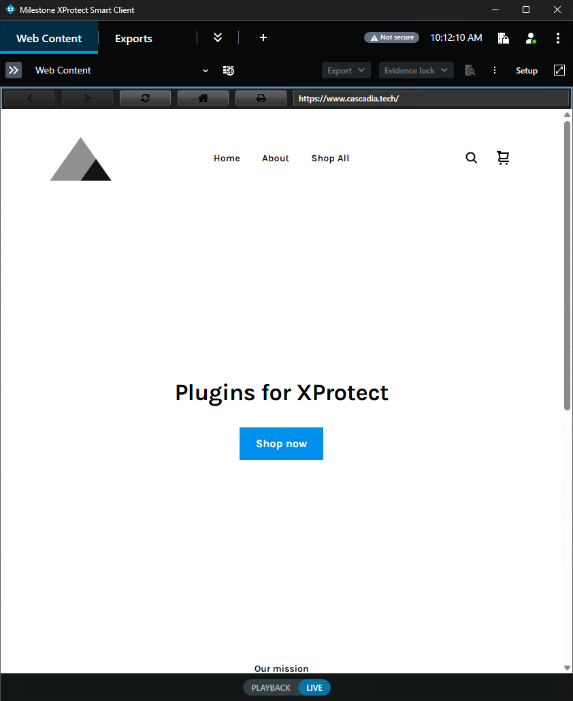
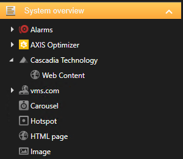
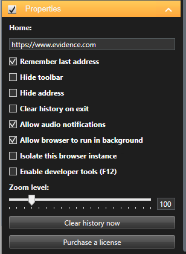

# Web Content Plugin for XProtect Smart Client

Add rich web content to the Smart Client with a browser component that is
always up to date and widely compatible with the modern web, popular IoT
platforms, and more.

The Web Content plugin uses the Microsoft Edge WebView2 runtime which means it
will always be kept up to date without the need to upgrade the plugin. And
because it is a Microsoft Edge browser, it will work with whatever content you
need it for.

## Getting started

### Install the plugin

1. Download [WebContentPlugin.zip](https://store-h8e7b0cwapcxhvh5.z02.azurefd.net/downloads/WebContentPlugin.zip)
2. Unblock the file by right-clicking on **WebContentPlugin.zip** and selecting **Properties**. If you see an "Unblock" checkbox in toward the bottom of the properties window, check the box and click OK.
3. Unzip **WebContentPlugin.zip** and run **setup.exe**

_Note: The **setup.exe** file will automatically install the WebView2 runtime if needed while **setup.msi** will not.

You should now see the plugin files in `C:\Program Files\VideoOS\MIPPlugins\`.
The OEM-friendly VideoOS folder is used by default which means the plugin will
work with Milestone's OEM partners as well.

### Add Web Content to a view

1. Open a new Smart Client instance (plugins are only discovered during startup) and login.
2. Click the **Setup** button at the top right.
3. Select an existing view, or create a new view.
4. Locate **Cascadia Technology > Web Content** in the **System Overview** side panel, and drag it into the view.

### Configuration

1. With the new Web View selected, scroll to the bottom of the side panel where you'll find the properties.
2. Update the Home address, and any other options as needed.
3. Click the **Setup** button again to exit setup mode.

## Licensing

No license is required when used with XProtect Essential+, or when connected to any XProtect VMS using a test license.

Under all other circumstances, a 30-day evaluation license will automatically be applied and a site license can be purchased from the [Cascadia Technology Store](https://www.cascadia.tech/). Make sure to provide your XProtect VMS (or OEM) Software License Code when placing the order.

### License activation

Once you have purchased a license from the [Cascadia Technology Store](https://www.cascadia.tech/), I must manually add a site license for the plugin to your software license code. You will receive a confirmation email when this has been completed.

To apply the license to your VMS, perform a normal online (or offline) license activation using Management Client on a system where the plugin is installed.

**Important:** The Web Content Plugin must be installed on the same system where Management Client is used to perform the activation, otherwise the Management Client won't include a license request from the plugin during the activation process.
